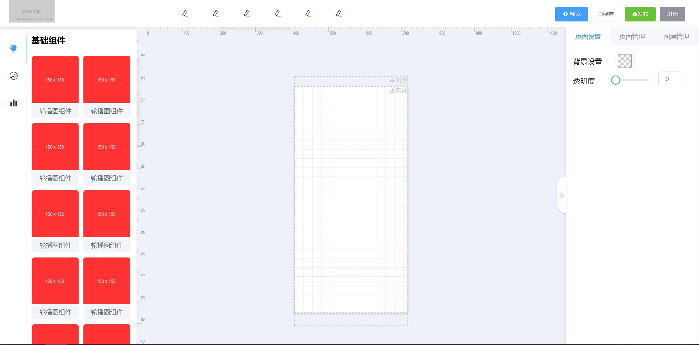

项目还开发中，将定期更新

## 技术栈

- **Vue** 前端主流框架(react,vue,angular)之一,更适合开发灵活度高且复杂的应用
- **Vuex** 主流的react应用状态管理工具，基于redux
- **vue-cli4** 基于vue的前端脚手架
- **Less** css预编译语言，轻松编写结构化分明的css
- **Element-Ui** 地球人都知道vue组件库
- **axios** 强大的前端请求库
- ~~**mand-mobile** 基于vue的移动端ui库，轻松实现美观的H5应用~~

TODO:

- [x] 编辑器界面搭建
- [ ] 基础组件库实现
- [ ] 组件数据动态编辑
- [ ] 组件库拖拽和显示
- [ ] H5页面的预览功能
- [ ] 支持组件复制, 右键删除
- [ ] 支持快捷键控制

## 前端界面
  菜单
  组件栏
  画布
  配置栏
  滚动条
  快捷键
  粘贴板

## 插件选择
  页面组件ui[elementUi](https://element.eleme.cn/2.14/#/zh-CN/component/layout)
  缩放拖拽 - [vue-draggable-resizable](https://github.com/mauricius/vue-draggable-resizable)
  缩放拖拽旋转 - [vue-draggable-resizable-rotatable](https://github.com/tmrcui/vue-draggable-resizable-rotatable)
  参考线 - [ref-line](https://github.com/think2011/ref-line)
  编辑器标尺 - vue-sketch-ruler
  表格组件 - [DataV](https://github.com/DataV-Team/DataV)
  图表组件[Eachat](https://echarts.apache.org/zh/index.html)
  操作历史[撤销重做] - indexdb(这里用snapshot不用mutation)
  图层操作[上移下移置顶置底]
  预览算法[全屏幕等比缩放]
  编辑器 [ace编辑器](https://github.com/ajaxorg/ace)
  滚动条 [vuebar](https://github.com/DominikSerafin/vuebar)

目前进度

参考资料:[在Vue项目中使用snapshot测试](https://juejin.cn/post/6844903749375393800)