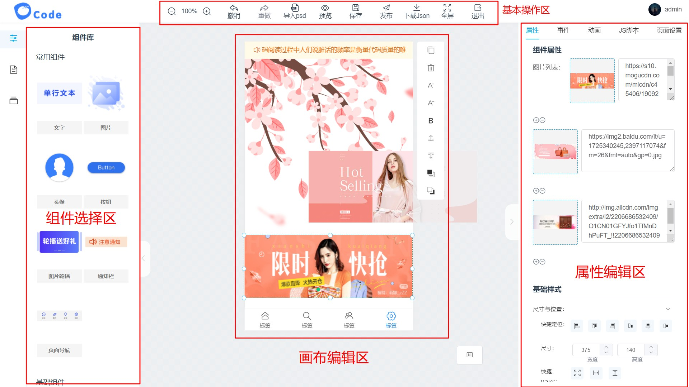

想完成但未完善问题（争取近期完善）：

- [ ] 导入PSD角度问题
- [ ] 导入PSD的文本字体大小不一致问题
- [ ] 个别PSD导入出现错误情况
- [ ] 画布大小自定义
- [ ] 组件锁定
- [ ] 右键菜单不同区域显示不同菜单
- [ ] 剪切组件
- [ ] 预览添加手机壳模型
- [ ] 组件拖拽多选
- [ ] 添加新人引导动画
- [ ] 完善表单数据功能
- [ ] 完善模板库

已有功能：

- [x] 拖拉组件至画布
- [x] 面板可收缩展开
- [x] 点击添加组件位置为默认位置
- [x] 添加导入PSD时显示进度条
- [x] 保存JSON文件
- [x] 上传JSON文件
- [x] 根据画布截图生成预览图
- [x] 自定义画布右键菜单
- [x] 添加常用快捷键
- [x] 清空画布
- [x] 画布标尺
- [x] 解决一些小问题
- [x] 创建外部图片库
- [x] 历史记录面板
- [x] 文本组件过滤敏感词
- [x] 自动保存画布内容
- [x] 用户登录界面美化
- [x] 用户登录增加滑动验证
- [x] 制作产品官网
- [x] 作品状态设置，外部不可访问
- [x] 增加二维码组件
- [x] 导入PSD可选择文字可编辑与全转为图片模式


## 工程目录结构

```
|-- client					--------前端项目界面代码
    |--common					--------前端界面对应静态资源
    |--components				--------组件
    |--config					--------配置文件
    |--eventBus					--------eventBus
    |--filter					--------过滤器
    |--mixins					--------混入
    |--pages					--------页面
    |--router					--------路由配置
    |--store					--------vuex状态管理
    |--service					--------axios封装
    |--App.vue					--------App
    |--main.js					--------入口文件
    |--permission.js			--------权限控制
|-- server					--------服务器端项目代码
    |--confog					--------配置文件
    |--controller				--------数据库链接相关
    |--extend					--------框架扩展
    |--model					-------Schema和Model
    |--middleware				--------中间件
    |--core						--------Koa MVC实现自动加载核心文件
    |--views					--------ejs页面模板
    |--public					--------静态资源
    |--router.js				--------路由
    |--app.js					--------服务端入口
|-- common					--------前后端公用代码模块（如加解密）
|-- engine-template			--------页面模板引擎，使用webpack打包成js提供页面引用
|-- docs					--------预留编写项目文档目录
|-- config.json				--------配置文件
```